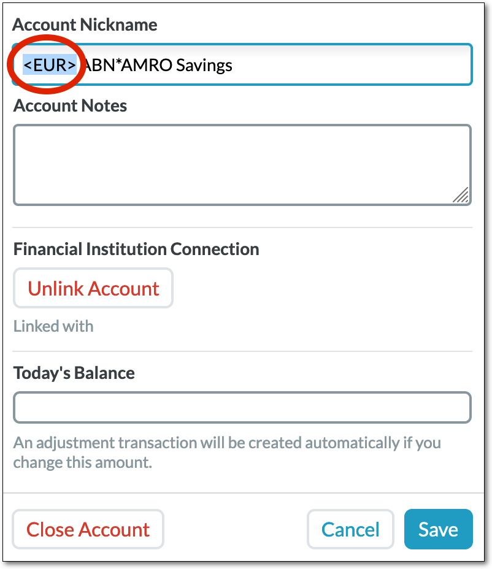
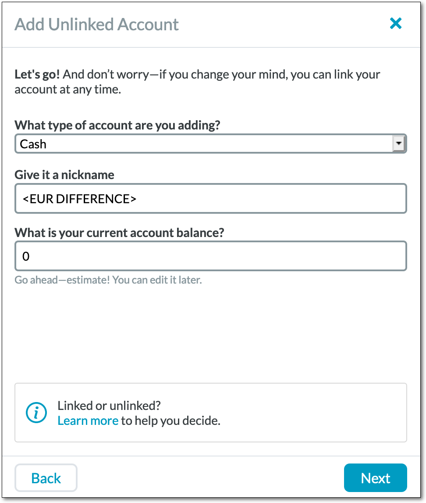
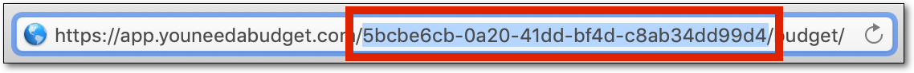
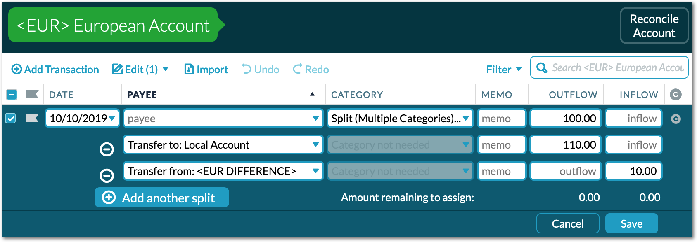

# Foreign currency accounts for YNAB.


Manage multiple currency accounts in a single budget in [You Need A
Budget.](https://www.youneedabudget.com/)

This is based on an approach that I've been using manually for several years
and found to work very well for our family budget which crosses three different
currencies and involves a lot of foreign transactions and transfers (after
trying a few other ways first).

**Preview version!**

## Overview

### Features

Some notable features of this approach that may set it apart from other
solutions (such using separate budgets for different currencies, or the [YNAB
Multi-Currency](https://ynab.rmillan.com/) app):

* All your accounts, both local and foreign currency, are in a single budget so
  you can see the state of all your finances at a glance.

* Auto-import, manual import, and reconciliation for foreign currency accounts
  works normally, in the original foreign currency.

* Reports and net worth will always be shown in your local currency, with all
  foreign amounts converted at an exchange rate accurate to within 24 hours.

* Budget categories are in your local currency, and it's no problem to mix
  local and foreign currency transactions in the same budget category.

* Handles split transactions.

* Foreign currency balances are automatically adjusted as the currency
  fluctuates, at an exchange rate accurate to within 24 hours.

* Your original transactions left are untouched.

* Uses historical exchange rates for transactions in the past.

### Approach

The approach boils down to:

* Transactions in foreign currency accounts are kept in their original
  foreign currencies.

* For each foreign currency in the budget, there is a "virtual" **difference
  account** that holds the difference between your total holdings in the
  foreign currency and your those holdings converted to your local currency.

* For each transaction in a foreign currency account, a corresponding
  transaction is created in the **difference account** with the difference
  between the foreign amount and the amount converted to your local currency
  (at the exchange rate of the day before the transaction's date).

* Adjustment transactions are created daily in the **difference account** to
  account for fluctuating exchange rates, with a special budget category used
  as a "buffer" for these fluctuations.

For example, if

* your local currency is U.S. Dollars
* you hold €100.00, and
* €1.00 = $1.10, then

the Euro difference account would hold $10.00, since

* €100.00 * $1.10/€1.00 = $110
* the difference ($110 - $100) is $10.

### Limitations

* Not going to help you out if you're spending in a foreign currency using a
  local currency account (e.g. using a U.S. credit card while visiting Europe),
  since there's no way to know what rate your financial institution will use
  for transactions.

* Probably not very useful for hyper-inflating currencies, but I'm not sure how
  you'd budget effectively with such a currency anyway.  Make a big exchange
  rate adjustment buffer category, I guess.  But you're probably best off
  immediately spending any money on tangible goods or converting it to
  something that holds value, since otherwise all the value will just inflate
  away away.


## How to use

**Important note: currently this preview is just a command-line tool with basic
features that you can run manually.** However, I intend to flesh this out into
a web application, if folks seem interested.

These instructions assume that you are familiar with using your operating
system's command-line terminal.

### Budget setup

There's some initial work required to set up your accounts the way this tool
needs (which, unfortunately, cannot currently be automated due to YNAB API
limitations), but once this has been done once it all keeps working without
much further manual intervention required.

This tool uses special "tags" to identify a foreign account's currency.  For
each foreign currency account:

1. Left-click the account
2. Put the three-letter currency code in angle brackets anywhere in the
   account's nickname or notes.  For example, a U.S. Dollar account would have
   `<USD>`, and a Euro account would have `<EUR>`.  Here is [a list of the
   supported currencies and their three-letter
   codes](https://free.currconv.com/api/v7/currencies?apiKey=sample-key-do-not-use).
3. Click **Save**.

   

You don't need to add any currency tag to your local currency accounts
(although it won't hurt anything if you do).

In addition, you must create one "virtual" difference account for each foreign
currency you use in your **budget** accounts (even if you have more than one
account in that currency):

1. Click the **Add Account** button
2. Choose **Unlinked**
3. In the **Add Account** dialog, enter:
   * **Account type:**: one of the **Budget** account types (such as
     **Cash**)
   * **Nickname:** a "tag" with the three-letter currency code followed by a
     space and `DIFFERENCE`, all in angle brackets (e.g. `<EUR DIFFERENCE>` for
     Euros)
   * **Current balance**: `0`
4. Click **Next** and then **Done**.

   

If you have foreign currency **tracking** accounts, you must do also create a
separate difference account for those (so that your worth in each is correct).
Follow the same instructions as above, but choose a **Tracking** account type
instead, such as **Asset (e.g. Investment)**.

Finally, create a budget category for foreign currency balance adjustments due
to exchange rate fluctuations.  You can name this anything you want, for
example `Foreign Currency Adjustments`.  You will need to budget enough in this
category to cover likely fluctuations in exchange rates given the amount of
your foreign currency holdings.  You can also create separate budget categories
for different currencies if you wish.

### Tool setup

1. Generate a YNAB Personal Access Token by following [these
   instructions](https://api.youneedabudget.com/#personal-access-tokens).

2. Get a free Currency Converter API token by clicking the **Get Your Free API
   Key** button [on this page](https://free.currencyconverterapi.com/).

3. Determine your budget's ID.  You can get this by opening your budget in YNAB
   and then looking at the URL in the location bar.  The budget ID is the
   string of random letters, numbers, and dashes that comes between
   `app.youneedabudget.com/` and `/budget` (e.g. if the URL is
   `https://app.youneedabudget.com/5bcbe6cb-0a20-41dd-bf4d-c8ab34dd99d4/budget`
   then the budget ID is `5bcbe6cb-0a20-41dd-bf4d-c8ab34dd99d4`).

   

4. Download the appropriate binary executable for your platform:

   | Platform           | Download link |
   |--------------------|---------------|
   | Linux (x86 64-bit) | [fca4ynab-0.1.0-x86_64-linux](https://github.com/borsboom/foreign-currency-accounts-for-ynab/releases/download/release%2F0.1.0/fca4ynab-0.1.0-x86_64-linux) |
   | macOS              | [fca4ynab-0.1.0-x86_64-darwin](https://github.com/borsboom/foreign-currency-accounts-for-ynab/releases/download/release%2F0.1.0/fca4ynab-0.1.0-x86_64-darwin) |
   | Windows (64-bit)   | [fca4ynab-0.1.0-x86_64-mingw64.exe](https://github.com/borsboom/foreign-currency-accounts-for-ynab/releases/download/release%2F0.1.0/fca4ynab-0.1.0-x86_64-mingw64.exe) |

   If your platform isn't listed, you can [build from
   source](#build-from-source).


5. On Linux and macOS, give the downloaded file execute permissions:

   ```
   $ chmod a+x /path/to/fca4ynab-0.1.0-*
   ```

6. Rename the binary to `fca4ynab` (`fca4ynab.exe` on Windows) and move it
   somewhere in your system PATH, if desired.

### First run

Run the following command, with the values in angle brackets (such as
`<YOUR-BUDGET-ID>`) substituted:

```
fca4ynab \
    --budget-id="<YOUR-BUDGET-ID>" \
    --currency-converter-api-key="<CURRENCY-CONVERTER-API-KEY>" \
    --ynab-access-token="<YNAB-PERSONAL-ACCESS-TOKEN>"`
```

This will output which foreign currency accounts were detected, and show you
any transactions that will be created, but will _not actually make any
changes_.

By default, this tool will only process transactions starting from the date you
first ran the tool.  If you prefer a different start date, use the
`--start-date=<YYYY-MM-DD>` argument to override it.  Note that you can only
set this the first time you run the tool for a given budget.

If you are happy with the plan, re-run it with the `--yes` argument to actually
create the difference and adjustment transactions.

Note that it may take a few minutes for the new transactions to show up in the
YNAB app.  If you're impatient to see them, reload the app and they should be
there.

### Set budget category for exchange rate fluctuations

The exchange rate adjustment transactions will not have a budget category set
by default, but they will have their payee set to `Exchange Rate Adjustments <CURRENCY>`.
Just set the category for one of these transactions after it's
been created, and YNAB will remember that category for adjustment transactions
created in the future. You can also use YNAB's **Manage Payees** screen to set
or change the automatic categorization.  You can also rename the payee here, if
you wish.

The adjustment payee is different for each currency, so you can set different
adjustment categories for each currency if you prefer.

### Transfers between currencies

This tool does not create balancing transactions for transfers to other
accounts by default, for two important reasons:

* When you transfer money to a different currency account, the exchange rate
  your financial institution gives you will almost certainly be different than
  the rate which this tool would use for automatic conversions.

* The other account should only see a single transaction of the full converted
  amount, since that's what the real bank account it's connected to will have.
  A balancing transaction would create a second transaction and make
  reconciliation difficult.

To enter a transfer to a different currency account, you must use a
split transaction:

* Parent transaction:
  * Outflow: amount leaving this account in its own currency
* Split 1:
  * Payee: **Transfer to: [the other account]**
  * Outflow: amount in other account's currency that your financial institution
    has converted to
* Split 2:
  * Payee: **Transfer to: [this account's currency's difference account]**
  * Amount: whatever YNAB tells you is left over (the difference between the
    amounts above)

For example, if:

* your local currency is U.S. Dollars (USD), and
* you're transferring €100 from a Euro (EUR) to a local U.S. Dollar account,
  and
* the exchange rate your bank gives you is €1.00 = $1.10, so
* the amount transferred to the local U.S. Dollar account will be $110, then

you would enter this split transaction in the Euro account:



Notice that you transfer the _difference_ ($110 - €100 = 10) to the `<EUR
DIFFERENCE>` account. Since the amount leaving the Euro account is less than the
amount going to the U.S. Dollar account, you need to do _something_ with the
difference, so that's where you put it.

When you run this tool, it will create an adjustment transaction in the
difference account that balances the difference between the exchange rate
your financial institution gave you and the rate this tool uses.

Note that if you were transferring to a currency worth more, the amount
leaving the source account would be _greater_ than the amount going to the
destination account, so the difference would go on the **Outflow** side instead
of the **Inflow**.  You don't really need to worry about that though; just
put it on the side that YNAB tells you to, and it'll all work out.

If you're transferring to another foreign currency account with a different
currency, the process is the same.  It doesn't matter which currency's
difference account you transfer the difference to; the end result will be the
same either way.  If you're transferring to another foreign currency account
with the _same_ currency, just do a normal transfer (no need to create a
split).

This all sounds kind of complicated, but you really don't need to worry about
the details.  This tool doesn't have any special logic for handling any of
this, it's just a natural consequence of the approach.  Just enter a split
transaction like above with the amounts of currency that your financial
institution tells you going out of and into each account, and whatever's left
over (which YNAB tells you) to the difference account, and it'll all work out!

If you forget to make a split transaction and just do a straight transfer, it's
not a big deal.  This tool will end up making a big adjustment transaction,
because it has to account for the full difference between the currencies,
rather than just the difference between your financial institution's exchange
rate and the tool's rate.  There's a good chance you'll notice that and, if
not, you'll definitely notice when you try to reconcile the destination
account. You can just fix it then, and a new adjustment transaction that
cancels out the mistake will be created automatically.  Once again it'll all
work out fine!

### Forcing or preventing automatic conversions

If you want to force a transfer transaction to have a balancing transaction
created despite the above, you can put `<CONVERT>` in the memo field.
Conversely, if you _don't_ want a non-transfer transaction to be converted, put
`<NOCONVERT>` in the memo field.

If there's an destination account that should _always_ have balancing
transactions created for transfers to/from it, put `<CONVERT>` in the account's
name or notes.  I use this for "virtual" tracking accounts that I use to track
business expenses, which are not connected to real financial institution
accounts.

### Other options

By default, this tool creates new transactions in an unapproved state so you
can easily check them.  Once you are comfortable with how things work, you may
prefer them to be auto-approved.  You can use the
`--auto-approve-transactions=true` and/or `--auto-approve-adjustments=true`
arguments (or corresponding environment variables) to do so.

For other options, run `fca4ynab --help`.

### Save budget ID and API keys configuration

If you do not wish to pass the budget ID and API keys on the command-line every
time you this tool, you can use environment variables to save them. See
`fca4ynab --help` for the environment variable names (e.g. `[env:
FCAY_BUDGET_ID=]` means the budget ID is set using the `FCAY_BUDGET_ID`
environment variable).  This tool will also read environment variables from a
file named `.env` in the ["dotenv"
format](https://github.com/bkeepers/dotenv#usage) from current and parent
directories.

### Scheduling

This tool makes efficient use of the YNAB API, and most of the time will only
use a single delta request to poll for new transactions.  As such, you can
safely run it on an automated schedule, such as every ten minutes.  You can use
your operating system's scheduling facility (such as `cron` on
macOS/Linux/other Un*x-like operating systems, or the Task Scheduler on
Windows), but documenting how that's done here is out of scope, so you'll have
to set that up for yourself.

## Additional notes

### Data file

This tool uses a local data file stored in your operating system's standard
data folder to keep track of the budget and transactions.  If you lose this
data file, it's not a really big deal but it does mean the tool won't be able
to update previously created transactions.

### Deleted transactions

The YNAB API does not provide a way for apps to delete transactions.  As such,
if a foreign currency transaction is deleted, the corresponding difference
account transaction cannot be deleted.  Instead the difference amount will be
changed to `0` and the memo will be set to `<DELETED>`.  For all intents and
purposes, this has the same end result.  Feel free to delete these transactions
yourself, if you wish, but they won't hurt anything.

### Exchange rates

Exchange rates are retrieved using the [Free Currency Converter
API](https://free.currencyconverterapi.com/).  The exchange rate for a given
date will only be retrieved once, for a few reasons:

* Avoid creating more than one adjustment transaction per day due to exchange
  rate fluctuations
* Have all difference transactions on a given day use the same exchange rate
* YNAB only records the date of a transaction, so no way to know the specific
  time for the exchange rate
* Avoids over-using the free currency converter API

This does mean it's somewhat arbitrary _which_ exchange rate you'll get for the
date, but it will be accurate to within 24 hours.

### Making accounts look nicer

The currency tags (e.g. `<EUR>`) don't look so nice in account nicknames, and
take a lot of screen real estate, so I like to put them in the account notes
instead and then put the emoji flag of the currency's country in the account
nickname.  For example, my Royal Bank of Canada chequing account has the
nickname "**🇨🇦RBC Chequing**," and has `<CAD>` in the account notes instead.

## Build from source

1. Install the Rust toolchain by following [the Rust installation instructions](https://www.rust-lang.org/en-US/install.html).
2. Download the source code and unpack: [.zip](https://github.com/borsboom/foreign-currency-accounts-for-ynab/archive/release/0.1.0.zip), [.tar.gz](https://github.com/borsboom/foreign-currency-accounts-for-ynab/archive/release/0.1.0.tar.gz), or clone the [Git repository](https://github.com/borsboom/foreign-currency-accounts-for-ynab/tree/release/0.1.0).
3. In the root of the source tree, run `cargo install --path .`.
